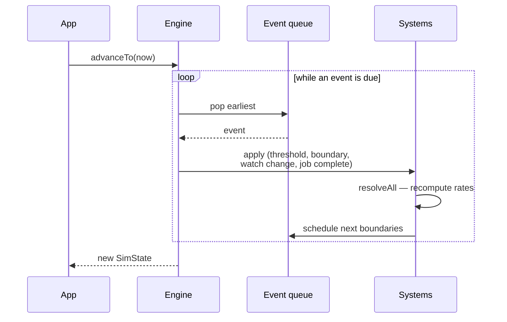
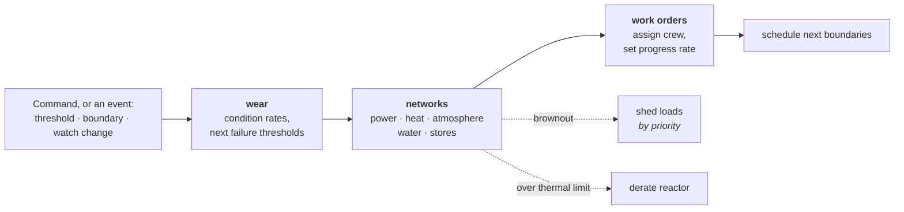
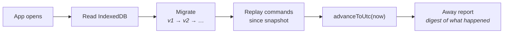

# Architecture

How Solar Syndicate is put together, and why the boundaries sit where they do.
For the reasoning behind individual game decisions, see
[`docs/design.md`](docs/design.md) — code comments reference its section
numbers (§7.2, §8.2, …) throughout.

## The shape of it

Three packages, one direction of dependency. The simulation is the centre of
the system and knows nothing about the browser.

```mermaid
graph TD
    subgraph browser["Browser (apps/web)"]
        UI["React components<br/><i>render views, emit commands</i>"]
        Store["Store (zustand)<br/><i>owns the current SimState</i>"]
        Persist["Persistence<br/><i>IndexedDB: snapshot + command log</i>"]
        SW["Service worker<br/><i>offline shell</i>"]
    end

    subgraph sim["@solsyn/sim — zero browser dependencies"]
        Engine["Engine<br/><i>advance, applyCommand, selectors</i>"]
        Systems["Systems<br/><i>networks, wear, work orders, crew</i>"]
        Core["Core<br/><i>event queue, reservoirs, time, rng, hash</i>"]
    end

    subgraph data["@solsyn/data"]
        Content["Content JSON<br/><i>hulls, rooms, parts, crew</i>"]
        Schemas["zod schemas<br/><i>validated once at load</i>"]
    end

    UI -->|Command| Store
    Store -->|"advanceTo / applyCommand"| Engine
    Engine -->|"immutable SimState"| Store
    Store --> UI
    Store <--> Persist
    Engine --> Systems
    Systems --> Core
    Systems --> Content
    Schemas --> Content

    style sim fill:#0f1a22,stroke:#4fd1d9
    style data fill:#0f1a22,stroke:#4fd1d9
```

**`packages/sim`** is the whole game. It is pure, deterministic, and free of
DOM references, so it runs unchanged in a browser, in Node under test, or on a
server. That boundary is the insurance policy for cloud save and the
shared-universe roadmap (design §8.4) and is cheap to keep only if never
crossed.

**`packages/data`** holds every gameplay number as JSON validated by zod. No
balance value lives in TypeScript. Content is parsed once at module load, so
anything malformed fails loudly and immediately rather than producing a subtly
wrong simulation later.

**`apps/web`** is a Vite + React PWA. It renders derived views and emits
commands; it never mutates simulation state.

## The four rules the design rests on

Everything else is a consequence of these.

| Rule | Enforced by |
|---|---|
| The sim is pure and deterministic — seeded PRNG, never reads the clock | ESLint bans `Math.random`, `Date.now`, `new Date` inside `packages/sim` |
| Levels are derived, never accumulated | Reservoirs are `(value, rate, since)`; anchors move only where rates change |
| Catch-up is not a special case | One `advanceTo` loop serves both live play and reopening after a week |
| Every mutation is a serializable `Command` | The UI has no other route into state |

## Time and state

`SimState` is a plain serializable object — no classes, no `Map`s, no
functions — because it is simultaneously the in-memory state, the save format,
and (eventually) the wire format.

Game time is seconds since **each world's own epoch**, which is the UTC instant
that world was created. One real hour is one game day (24×, design §7.1). The
multiplier lives in exactly one place.

Continuous quantities are **reservoirs**: `(value, rate, since)`. The level at
any time is one multiply, so reading a month into the future costs the same as
reading now. Anchors move only when a *rate* changes — never on a read — which
is what makes advancing a month in a single jump bit-identical to advancing it
in seven hundred steps.

## How time advances

The engine is an event queue, not a tick loop. Between events, everything is a
closed-form function of time, so the only thing that needs scheduling is the
moment something crosses a boundary.

Reopening the app after a week runs this same loop; it simply pops more events.
A month of absence is a few thousand events rather than 2.6 million ticks, so
catch-up completes in milliseconds. There is deliberately no separate "offline
progress" path that could drift out of step with live play.

## Resolving the ship

The five resource networks are genuinely coupled — every watt consumed inside
the hull becomes heat that must be rejected, the electrolysis unit spends water
to make oxygen, and the crew are a load on all of them — so they resolve
together in one pass, in a fixed order.

Order matters: wear sets part condition, networks read condition to compute
output, and work orders read the resulting environment to decide how fast the
crew can work. One ordering, in one place, so a new system can only be wired in
correctly.

**Attendance** (`attendance.ts`) feeds the first two. A room's wear rate and its
parts' efficiency depend on who is standing watch in it — scaled by that
person's current effectiveness, so fatigue and bad air feed back into the
machinery they are tending. It reads state and returns numbers; it schedules
nothing. That matters: attendance changes only when a watch turns over or a work
order moves, and both of those already re-resolve the world, so nothing new had
to fire for the ship to respond and offline catch-up stays bit-identical.

A part's rated figures are what it delivers **unattended**, so attendance is
always a multiplier ≥ 1 on output and the only penalty for a deserted room is a
mild 1.15× on wear. An unattended ship therefore holds spec indefinitely, which
is design §7.4 enforced by the shape of the code rather than by vigilance.

The two dotted paths are the ship protecting itself while nobody is watching
(design §7.4): load shedding by priority when the battery empties, and a
thermal trip that derates the reactor rather than cooking the crew. Neither can
switch off a life-critical system.

## Save and resume

A save is a **snapshot plus a command log**. Loading replays any commands
recorded since the snapshot, then fast-forwards to now.

Snapshots are versioned with explicit migration functions from the first
version, because breaking saves is the cardinal sin of an app people install
and leave for months. The command log exists from day one because it is the
part that must be designed in rather than retrofitted: it is what makes
periodic (rather than per-change) snapshots possible, and what a
server-authoritative simulation would consume as its wire protocol.

## Rendering

The ship is a portrait vertical deck stack — bridge at the nose, engines at the
bottom — which is both physically correct for a torchship under thrust and the
reason the game fits a phone.

It is DOM and SVG rather than canvas: free text layout, free accessibility,
trivial responsiveness, fast to iterate. Everything sits behind the
`ShipViewport` props interface, so swapping in a canvas renderer later means
writing one new component rather than rewriting the app.

**The schematic is generated, not drawn** (spec 003). Each deck is an SVG whose
height comes from the room's `deckUnits` and whose contents come from the
parts installed in it plus the fixtures the room declares. Every object picks
its shape from a closed `Glyph` enum in `@solsyn/data`; `shipGlyphs.tsx` is the
only file that knows what a glyph looks like, and `packGlyphs` places them
without knowing what they are. Adding a part to `parts.json` puts it on the
ship with no code change — which is why this direction was chosen over
hand-illustrated interiors, where every component would have been an art
commission.

Crew appear as markers on the deck they are in. That deck is **derived** from
activity, work order and declared station (`crewRoomId`) rather than stored, so
the picture cannot drift out of agreement with the roster and no save needs
migrating to show people aboard.

`crewRoomId` lives in `crew.ts`, not in the selector layer, because the
simulation depends on it too: `attendance.ts` turns a room's wear rate and
efficiency on who is standing watch there. Two definitions of "where is she"
would drift, and the drawing would stop agreeing with the physics.

The **flow overlay** is an optional layer inside the same SVGs, drawing power,
heat and water as links whose width comes from the same `roomViews` figures the
deck headers print. It occupies a permanently reserved right-hand margin, so
switching it on never reflows the schematic beneath it.

The UI reads **selectors** (`powerView`, `lifeSupportView`, `crewViews`,
`workOrderViews`, `roomViews`) rather than `SimState` directly. Selectors are
the published surface of the simulation; the state shape stays free to change
behind them. Every figure a selector reports goes through one function, so
per-room power always sums to the ship total — if those disagree, the player
cannot reason about their own ship.

## Testing

| Layer | What it proves |
|---|---|
| `packages/sim/test/catchup.test.ts` | The architectural claims: bit-identical catch-up, determinism, JSON round-trip fidelity, a decade of simulation under a second |
| `networks.test.ts`, `maintenance.test.ts` | That failures *propagate* — a dead scrubber becomes bad air becomes slower repairs |
| `scripts/verify.mjs` | The built PWA driven in Chromium at a phone viewport, served from the deployment subpath, with clock emulation to prove the ship keeps running while closed |

The unit tests deliberately assert claims rather than implementation details.
Both layers have caught real bugs: an infinite event-scheduling loop from
floating-point residue at a reservoir boundary, a time-anchoring flaw that
started worlds on day 3642, per-room figures that stopped summing to the ship
total, and a heat model with no passive hull radiation.

## Deployment

`main` builds and deploys to GitHub Pages via Actions. The build uses relative
asset paths, so the same artifact runs from a project subpath, the domain root,
or straight off disk — and `verify.mjs` serves it from a subpath so that
remains true.
